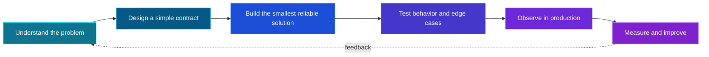

<!-- Profile README for github.com/demo-23home -->

<div align="center">


[](https://git.io/typing-svg)

<p>
  <a href="https://demo-23home.github.io/Portfolio-Website/"></a>
  <a href="https://www.linkedin.com/in/demo-23home/"></a>
  <a href="https://x.com/zeyadslama23"></a>
  <a href="https://medium.com/@demo23home"></a>
</p>


</div>

---

## `> whoami`

```python
class ZeyadSalama:
    role = "Backend Software Engineer"
    backend_stack = ["Python", "Django", "PostgreSQL"]
    frontend_stack = ["React", "Next.js", "TypeScript"]
    interests = ["API Design", "Clean Architecture", "Full-stack Products"]
    mindset = "Build simply. Scale thoughtfully. Keep learning."

    def current_mission(self):
        return "Turning complex requirements into reliable software 🚀"
```

<table>
  <tr>
    <td>🔭 <b>Building</b></td>
    <td>Reliable backend services and clean APIs</td>
  </tr>
  <tr>
    <td>🧠 <b>Exploring</b></td>
    <td>System design, performance, and distributed systems</td>
  </tr>
  <tr>
    <td>⚙️ <b>I value</b></td>
    <td>Readable code, thoughtful architecture, and dependable delivery</td>
  </tr>
  <tr>
    <td>🤝 <b>Open to</b></td>
    <td>Interesting opportunities and meaningful collaborations</td>
  </tr>
</table>

## `> build --what`

<table>
  <tr>
    <td width="33%" align="center">
      <h3>⚡ Backend APIs</h3>
      <p>Clear contracts, reliable validation, secure authentication, and maintainable business logic.</p>
    </td>
    <td width="33%" align="center">
      <h3>🗄️ Data Systems</h3>
      <p>Thoughtful schemas, efficient queries, caching strategies, and asynchronous workflows.</p>
    </td>
    <td width="33%" align="center">
      <h3>⚛️ Modern Frontends</h3>
      <p>Responsive React and Next.js interfaces connected to dependable backend services.</p>
    </td>
  </tr>
</table>

## `> philosophy --engineering`

> Great software is not only code that works—it is code that another engineer can understand, trust, and extend.



## `> tech --stack`

<div align="center">

### Backend & Data

[](https://skillicons.dev)

### Frontend

[](https://skillicons.dev)

### DevOps & Tools

[](https://skillicons.dev)

</div>

<details>
<summary><b>See how I use these technologies</b></summary>
<br />

| Area | What I work with |
|---|---|
| **Backend engineering** | Python, Django, REST APIs, background jobs |
| **Data & messaging** | PostgreSQL, Redis, RabbitMQ |
| **Frontend engineering** | React, Next.js, TypeScript, JavaScript, HTML5, CSS3, Bootstrap |
| **Infrastructure** | Docker, Linux, Nginx, Bash, Heroku |
| **Developer workflow** | Git, Postman, testing, debugging, automation |

</details>

## `> roadmap --current`

<table>
  <tr>
    <td width="50%" valign="top">
      <h3>📚 Deepening</h3>
      <ul>
        <li>Scalable system design</li>
        <li>Database performance and indexing</li>
        <li>Event-driven architecture</li>
        <li>Testing and observability</li>
        <li>Next.js rendering and performance</li>
      </ul>
    </td>
    <td width="50%" valign="top">
      <h3>🎯 Practicing</h3>
      <ul>
        <li>Designing clean service boundaries</li>
        <li>Building resilient API integrations</li>
        <li>Creating reusable React components</li>
        <li>Automating delivery workflows</li>
        <li>Writing clearer technical documentation</li>
      </ul>
    </td>
  </tr>
</table>

## `> projects --featured`

<div align="center">

[](https://github.com/demo-23home/Portfolio-Website)

<a href="https://github.com/demo-23home?tab=repositories">
  
</a>

</div>

## `> writing --latest`

<div align="center">

### Fresh thoughts from my engineering journey ✍️

</div>

<!-- BLOG-POST-LIST:START -->
- New Medium articles will appear here automatically after the workflow's first run.
<!-- BLOG-POST-LIST:END -->

<div align="center">

[](https://medium.com/@demo23home)

</div>

## `> github --stats`

<div align="center">


<sub>Language statistics are based on public repositories and do not indicate proficiency.</sub>

</div>

## `> contributions --timeline`

<div align="center">

[](https://github.com/demo-23home)

### Watch the contribution snake eat my commits 🐍

<picture>
  <source media="(prefers-color-scheme: dark)" srcset="https://raw.githubusercontent.com/Demo-23home/Demo-23home/output/github-snake-dark.svg" />
  <source media="(prefers-color-scheme: light)" srcset="https://raw.githubusercontent.com/Demo-23home/Demo-23home/output/github-snake.svg" />
  
</picture>

</div>

## `> beyond --code`

| 🧩 Problem solving | ✍️ Technical writing | 🌱 Open source | 🤝 Collaboration |
|:---:|:---:|:---:|:---:|
| Breaking difficult problems into smaller, testable parts | Sharing ideas and lessons through Medium | Learning in public and contributing where I can | Building better outcomes through clear communication |

<div align="center">


</div>

## `> connect --with-me`

<div align="center">

I enjoy meeting people who care about building useful, well-engineered software.

**Have an idea, an opportunity, or a challenging backend problem? Let’s talk.**

[](https://github.com/demo-23home?tab=repositories)
[](https://www.linkedin.com/in/demo-23home/)


</div>
